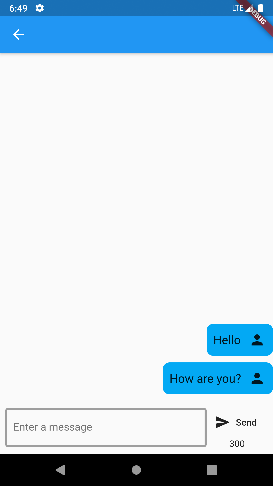
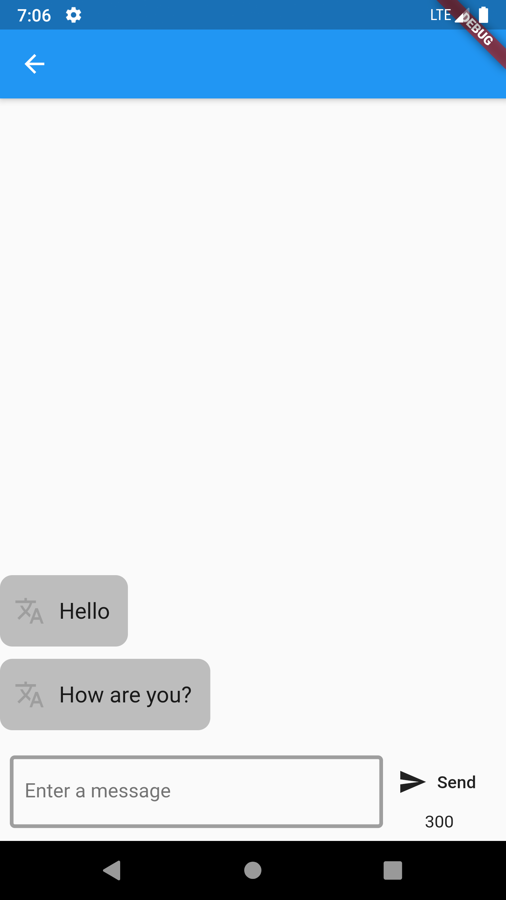
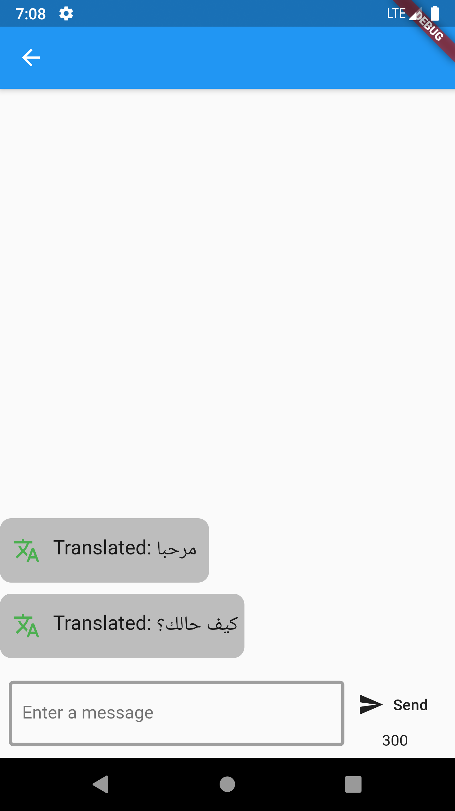
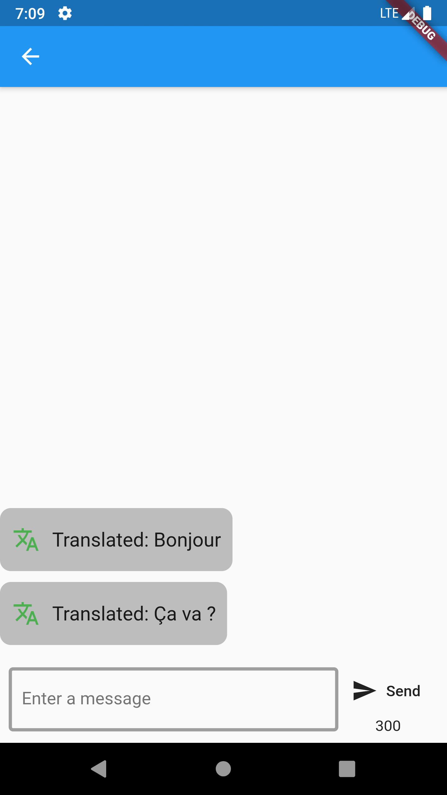

# 🚨**About this repo**🚨

## Language: 

**Dart**  

## SDK:
**Flutter** 

## Database:
**Firebase**

This repository includes a chat app built using Flutter and Firebase for the back-end. The distictive feature of the application is the ability to translate messages from one language to the other inside the chat itself.
***
## Screenshots:

